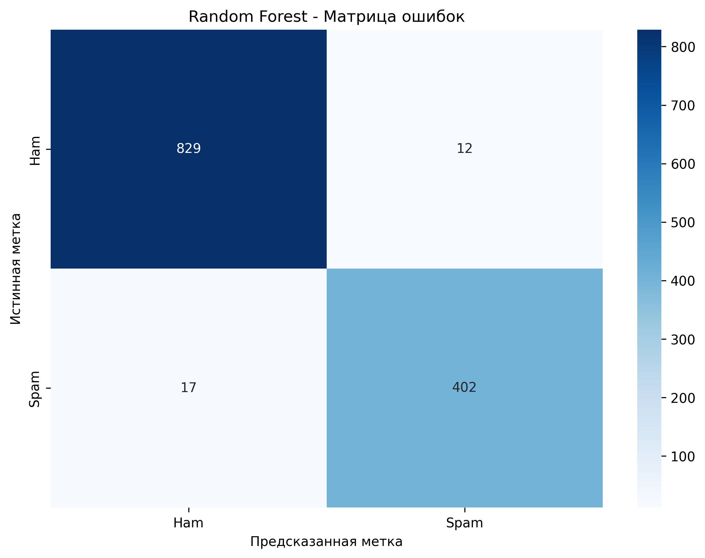
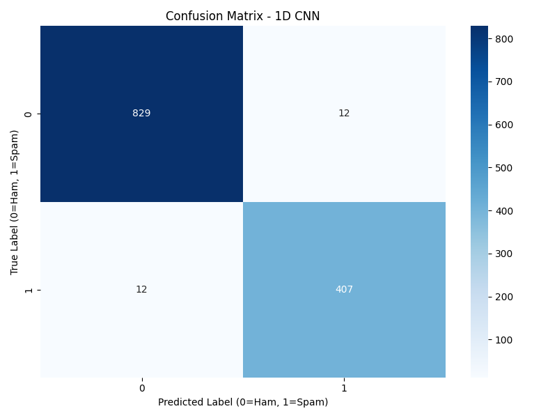
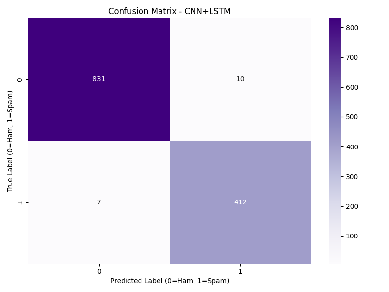

# AntiSpam AI - Классификация спама по содержимому писем

## 📋 Описание

Модель нейронной сети для классификации email-сообщений на **HAM** (обычные письма) и **SPAM** на основе текстового содержимого письма.

**Лучший результат:** CNN+LSTM архитектура с точностью **98.49%** и F1-Score **97.72%**

---
## Другие результаты
### RANDOM FOREST

### CNN1D

### Bidirectional LSTM

### CNN+LSTM

## 🎯 Результаты модели

| Метрика | Значение |
|---------|----------|
| **Accuracy** | 98.49% |
| **Precision** | 98.08% |
| **Recall** | 97.37% |
| **F1-Score** | 97.72% |

### Матрица ошибок:
- True Negatives (Ham → Ham): **833**
- False Positives (Ham → Spam): **8**
- False Negatives (Spam → Ham): **11**
- True Positives (Spam → Spam): **408**

---

## 🏗️ Архитектура модели

**Гибридная CNN+LSTM модель:**

```
Input Text (до 1604 токенов)
    ↓
Embedding Layer (128-dim)
    ↓
CNN Layers (3 параллельных свертки: 3-gram, 4-gram, 5-gram)
    ↓
Concatenation (768 признаков)
    ↓
Bidirectional LSTM (256 hidden units)
    ↓
Dense Layers
    ↓
Output (Ham/Spam + вероятности)
```

### Гиперпараметры:
- **MAX_LEN**: 1604 токенов
- **EMBEDDING_DIM**: 128
- **NUM_FILTERS**: 256
- **LSTM_HIDDEN**: 256 (BiLSTM → 512)
- **DROPOUT**: 0.5

---

## 📦 Требования

```bash
torch>=2.0.0
numpy>=1.24.0
scikit-learn>=1.3.0
matplotlib>=3.7.0
seaborn>=0.12.0
```

Установка:
```bash
pip install -r requirements.txt
```

---

## 🚀 Быстрый старт

### 1. Загрузка модели и предсказание

```python
from main import SpamClassifierPredictor
from data_loader import load_emails
from sklearn.model_selection import train_test_split

# Загрузка данных для построения словаря
texts, labels = load_emails("data/extracted/body")
X_train, X_test, y_train, y_test = train_test_split(
    texts, labels, test_size=0.3, random_state=42, stratify=labels
)

# Инициализация предиктора
predictor = SpamClassifierPredictor(
    model_path="test_models/best_cnn_lstm_model.pth",
    model_type='cnn_lstm',
    max_len=1604
)

# Загрузка модели
predictor.load_model(X_train)

# Предсказание
text = "Congratulations! You won $1,000,000! Click here now!"
result = predictor.predict(text)

print(f"Prediction: {result['prediction']}")
print(f"Ham probability: {result['ham_probability']:.2%}")
print(f"Spam probability: {result['spam_probability']:.2%}")
```

### 2. Запуск демонстрации

```bash
python main.py
```

Этот скрипт:
- Загружает обученную модель
- Тестирует на случайных образцах
- Показывает примеры классификации
- Опционально: полная оценка на тестовой выборке

---

## 🔌 API для интеграции

### Класс `SpamClassifierPredictor`

#### Инициализация
```python
predictor = SpamClassifierPredictor(
    model_path="test_models/best_cnn_lstm_model.pth",
    model_type='cnn_lstm',
    max_len=1604
)
predictor.load_model(training_texts)
```

#### Методы

**`predict(text: str) -> dict`**

Классифицирует один текст.

**Вход:**
- `text` (str): текст письма

**Выход:**
```python
{
    'prediction': 'SPAM' | 'HAM',
    'prediction_label': 0 | 1,  # 0=HAM, 1=SPAM
    'ham_probability': float,   # 0.0-1.0
    'spam_probability': float,  # 0.0-1.0
    'confidence': float         # max(ham_prob, spam_prob)
}
```

**Пример:**
```python
result = predictor.predict("URGENT: Click here to claim your prize!")
# {
#     'prediction': 'SPAM',
#     'prediction_label': 1,
#     'ham_probability': 0.02,
#     'spam_probability': 0.98,
#     'confidence': 0.98
# }
```

---

**`predict_batch(texts: list) -> list`**

Классифицирует несколько текстов.

**Вход:**
- `texts` (list[str]): список текстов писем

**Выход:**
- `list[dict]`: список результатов для каждого текста

**Пример:**
```python
texts = [
    "Meeting at 3pm tomorrow",
    "You won a lottery! Click now!"
]
results = predictor.predict_batch(texts)
# [
#     {'prediction': 'HAM', 'spam_probability': 0.05, ...},
#     {'prediction': 'SPAM', 'spam_probability': 0.97, ...}
# ]
```

---

## 🔗 Интеграция с моделью метаданных

Для объединения с моделью классификации метаданных рекомендуется:

### Вариант 1: Ансамбль (голосование)

```python
# Ваша модель (текст)
text_result = text_predictor.predict(email_body)
text_spam_prob = text_result['spam_probability']

# Модель коллег (метаданные)
metadata_spam_prob = metadata_predictor.predict(email_metadata)

# Взвешенное голосование
final_spam_prob = 0.6 * text_spam_prob + 0.4 * metadata_spam_prob
final_prediction = 'SPAM' if final_spam_prob > 0.5 else 'HAM'
```

### Вариант 2: Последовательное применение

```python
# Сначала проверка по метаданным (быстро)
if metadata_spam_prob > 0.9:
    return 'SPAM'
elif metadata_spam_prob < 0.1:
    return 'HAM'
else:
    # Неоднозначный случай - проверяем текст
    text_result = text_predictor.predict(email_body)
    return text_result['prediction']
```

### Вариант 3: Конкатенация признаков

```python
# Объединение вероятностей как признаков для финальной модели
features = [
    text_result['spam_probability'],
    metadata_spam_prob,
    text_result['confidence'],
    # другие признаки...
]

# Финальный классификатор (например, Logistic Regression)
final_prediction = final_classifier.predict([features])
```

---

## 📁 Структура проекта

```
AntiSpamAI/
├── main.py                      # Главный скрипт с API
├── data_loader.py               # Загрузка и обработка данных
├── requirements.txt             # Зависимости
├── MODEL_PARAMS.md              # Подробные параметры моделей
│
├── models/                      # Архитектуры моделей
│   ├── cnn_lstm.py             # CNN+LSTM (лучшая модель)
│   ├── bilstm.py               # Bidirectional LSTM
│   ├── cnn_1d.py               # 1D CNN
│   └── random_forest.py        # Random Forest (baseline)
│
├── test_models/                 # Обученные модели и тесты
│   ├── best_cnn_lstm_model.pth # ⭐ Лучшая модель (98.49%)
│   ├── test_cnn_lstm.py        # Скрипт обучения CNN+LSTM
│   ├── test_bilstm.py          # Скрипт обучения BiLSTM
│   └── test_cnn1d.py           # Скрипт обучения CNN1D
│
└── data/
    └── extracted/
        └── body/                # Текстовое содержимое писем
            ├── easy_ham_*.txt
            ├── hard_ham_*.txt
            └── spam_2_*.txt
```

---

## 🔧 Переобучение модели

Если нужно переобучить модель на новых данных:

```bash
cd test_models
python test_cnn_lstm.py
```

Параметры можно изменить в начале файла `test_cnn_lstm.py`.

---

## ⚠️ Важные замечания

1. **Словарь (vocab)**: Модель требует построения словаря на тренировочных данных. При интеграции используйте те же данные для построения словаря, что и при обучении.

2. **Длина последовательности**: Модель обучена на последовательностях длиной **1604 токена**. Более длинные тексты обрезаются, короткие - дополняются padding.

3. **Гиперпараметры**: При загрузке модели **критически важно** использовать те же гиперпараметры, что и при обучении. См. `MODEL_PARAMS.md`.

4. **Производительность**: Предсказание одного письма занимает ~10-50ms на CPU, ~2-5ms на GPU.

---

## 📊 Датасет

**Источник**: Ham/Spam Email Dataset

**Статистика:**
- Ham письма: 2801 (Easy: 2551, Hard: 250)
- Spam письма: 1397
- **Всего**: 4198 писем

**Разделение:**
- Train: 70% (2938 писем)
- Test: 30% (1260 писем)

**Характеристики текста:**
- Средняя длина: 386 слов
- Медиана: 166 слов
- 95-й перцентиль: 1604 слов
- Максимум: 14954 слов

---


